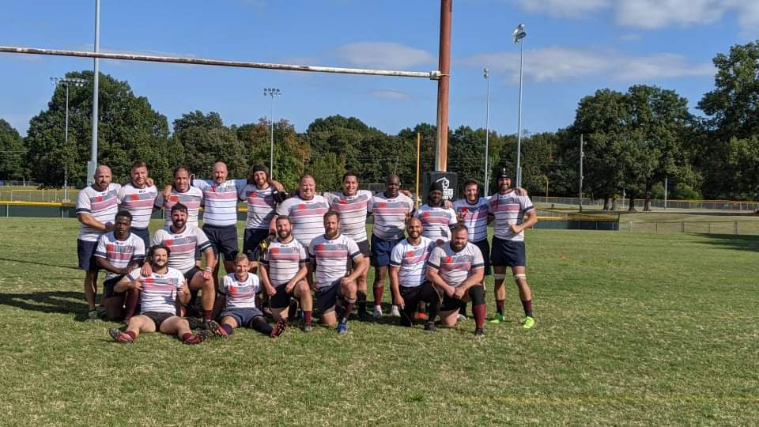

<h1 data-testid="page-title">Join The Team!</h1>

Interested in joining the Huntsville Rugby Club? Fill out the form below and somebody will be in touch with you!

Or, you can join us at practice every Tuesday and Thursday from 6pm to 8pm at the Rick Cooper Memorial Park in Huntsville, AL.

  <form
    name="join"
    method="post"
    data-netlify="true"
    netlify-honeypot="bot-field"
    style={{ minWidth: `100%` }}
  >
    <input type="hidden" name="bot-field" />
    

      Name: <input type="text" name="name" style={{ minWidth: `100%` }}/>
    

    

      <label>
        Email: <input type="email" name="email" style={{ minWidth: `100%` }}/>
      </label>
    

    

      <label>
        Phone Number: <input type="tel" name="phone" style={{ minWidth: `100%` }}/>
      </label>
    

    

      <label>
        Message: <textarea name="message" style={{ minWidth: `100%` }}></textarea>
      </label>
    

    

      <button type="submit">Send</button>
    

  </form>

