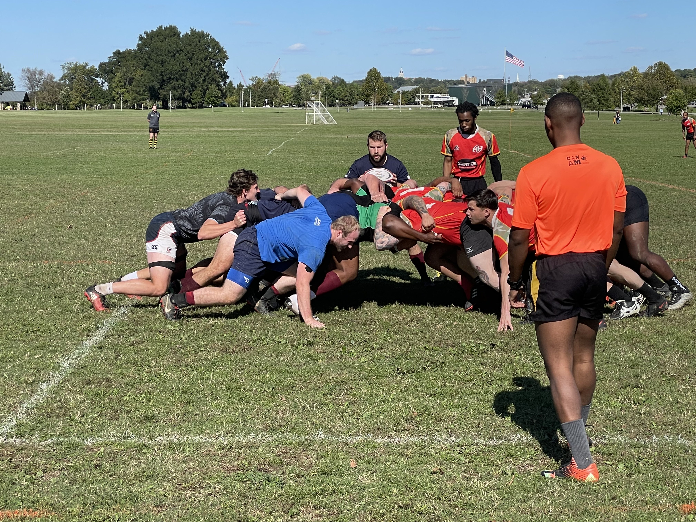

# Sponsor The Team!

### Current Sponsors:

- [Yellowhammer Brewing](https://www.yellowhammerbrewery.com/)
- [Phat Sammy's](https://www.phatsammys.com/)
- [The Poppy & Parliament](https://www.thepoppyandparliament.com/)
- [Mad Malts Brewing](https://sites.google.com/view/madmalts)

##### Interested in sponsoring the Huntsville Rugby Club?

###### Fill out the form below and somebody will be in touch with you!

  <form
    name="sponsor"
    method="post"
    data-netlify="true"
    netlify-honeypot="bot-field"
    style={{ minWidth: `100%` }}
  >
    <input type="hidden" name="bot-field" />
    

      Name: <input type="text" name="name" style={{ minWidth: `100%` }}/>
    

    

      <label>
        Email: <input type="email" name="email" style={{ minWidth: `100%` }}/>
      </label>
    

    

      <label>
        Phone Number: <input type="tel" name="phone" style={{ minWidth: `100%` }}/>
      </label>
    

    

      <label>
        Message: <textarea name="message" style={{ minWidth: `100%` }}></textarea>
      </label>
    

    

      <button type="submit">Send</button>
    

  </form>

